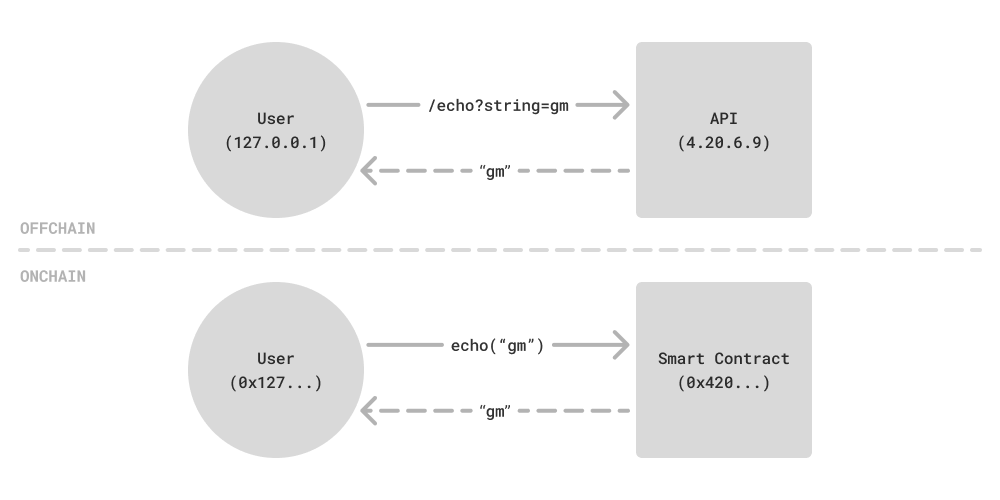

<Info>
A smart contract is like a microservice: It defines an external **interface**, maintains **state**, and can make **interactions** with other services.
</Info>


# Interface (Example: Echo)

Smart contracts define functions which are like API routes. A service can expose many functions and each function has specific inputs and outputs.



<Info>
Try pasting the below commands into your terminal.
</Info>

```bash API Call
curl --get http://4.20.6.9/echo?message=gm
```

<Info>
To add the `cast` CLI, follow this [installation guide](https://book.getfoundry.sh/getting-started/installation).
</Info>

```bash Smart Contract Call
cast call 0x80617f1058D431A7a8394761DE26C711ce5963D0 "echo(string)(string)" "gm" --rpc-url "https://sepolia.base.org" 
```

Smart contracts share similar abstractions for a call target, function, and arguments:

| Item | API | Smart Contract |
|---------|-----|----------------|
| Target | IP address -> `4.20.6.9` | Blockchain address -> `0x...` |
| Function | URL path ->`/echo`| Function signature -> `echo(string)` |
| Arguments | URL-encoded args -> `message=gm` | ABI-encoded args -> `"gm"` |

## Solidity Implementation

Let's review the source code from the previous `Echo` smart contract example:
```solidity lines
contract Echo {
    function echo(string calldata message) external pure returns (string calldata) {
        return message;
    }
}
```

Key syntax (going left to right):
* `contract`: defines a smart contract
* `function`: defines a function
* `string`: type of the `message` argument, `string` is a built-in type with variable length
* `calldata`: accessory to variable-length types, `calldata` makes the variable read-only
* `external`: visibility of the function, `external` makes it callable from other addresses
* `pure`: mutability of the function, `pure` declares it does not read from or write to storage
* `returns`: defines a return with type following in parentheses

<Info>
Smart contract functions are like strongly-typed APIs, but with additional powers. For now, this example highlights the **modifier** feature and two instances of it: visibility and mutability**.
</Info>

### Modifiers

Modifiers are accessories that can be added to functions to modify their behavior. They come after the function signature (name and arguments) and before the function body (`function name(args) modifiers { body }`).

Two modifiers are used in every function: visibility and mutability.

**Visibility – Who is allowed to call the function**

* `external`: callable only from other addresses
* `internal`: callable only from within this address
* `public`: callable both internally and externally
* `private`: callable only from within this contract (not accessible to inheriting contracts)

**Mutability – How the function interacts with storage**

* (empty): able to read from and write to storage (default)
* `view`: only allowed to read from storage
* `pure`: not allowed to read from or write to storage

# State (Example: Higher)

## Storage

Simply define variables within the contract to define your storage schema. 
Functions can read and write to storage just like how they would interact with a local variable.
Values written to storage will persist on the blockchain for future function calls.

Note that storage variables also have visibility. The compiler will automatically create a `view` function with visibility matching the storage variable declaration.

```solidity lines
contract Higher {
    uint256 public height; // uint256: unsigned integer of 256 bits (default number type)

    error AimHigher();

    function higher(uint256 increase) external returns (uint256 newHeight) {
        if (increase == 0) revert AimHigher();

        newHeight = height + increase;
        height = newHeight;
        return newHeight;
    }
}
```

## Logs

Logs are events that are emitted by the contract. They are added to the blockchain's state, but are not stored in the contract's storage.
This makes them not readable during smart contract execution, but can be viewed offchain. They are most useful for indexing services that will aggregate chain state.

```solidity lines
contract Higher {
    uint256 public height;

    // [!code ++]
    event WentHigher(uint256 increase, uint256 newHeight);

    error AimHigher();

    function higher(uint256 increase) external returns (uint256 newHeight) {
        if (increase == 0) revert AimHigher();

        newHeight = height + increase;
        height = newHeight;
        // [!code ++]
        emit WentHigher(increase, newHeight);
        return newHeight;
    }
}
```

<Info>
Make sure you have completed [setup](./0-overview#setup).
</Info>

Send a transaction to call `higher`:
```bash
cast send 0x4B2c6DFf1d611A0e31684FAEc557FFf7c675f525 "higher(uint256)" 1 --rpc-url "https://sepolia.base.org" --account dev
```

Read the updated state of the contract:
```bash
cast call 0x4B2c6DFf1d611A0e31684FAEc557FFf7c675f525 "height()(uint256)" --rpc-url "https://sepolia.base.org"
```

View the logs (takes longer to load):
```bash
cast logs --address 0x4B2c6DFf1d611A0e31684FAEc557FFf7c675f525 "WentHigher(uint256,uint256)" --rpc-url "https://sepolia.base.org"
```
